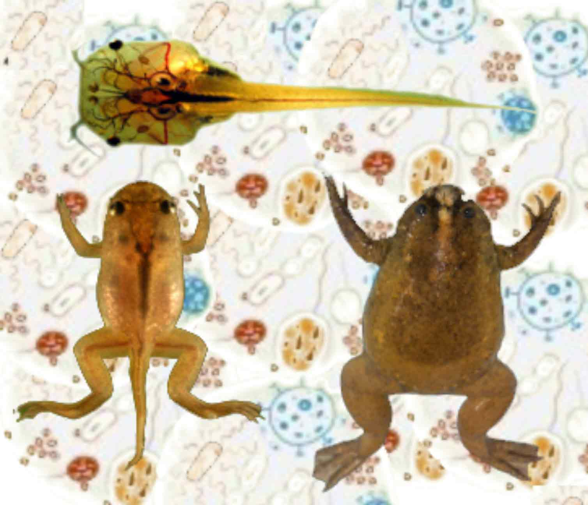

```{r setup, include=FALSE}
knitr::opts_chunk$set(echo = TRUE)
```


You will find here a set of R scripts dealing with the analysis of ***Xenopus* microbiomes**.

- analysis of the succession of communities across [LifeStages](LifeStages.html)

- analysis of communities across [Adult habitats](LifeStages.html)

- analysis of communities influenced by diet in tadpoles [Diet](Diet.html)

- analysis of active communities at [early and late](EarlyLate.html) life stages

- analysis of communities transmitted [between adult skin and feces toward eggs](Transmission.html)

- analysis of the [metagenome and metatranscriptome](Metagenome.html) including metabolic pathways inference 
